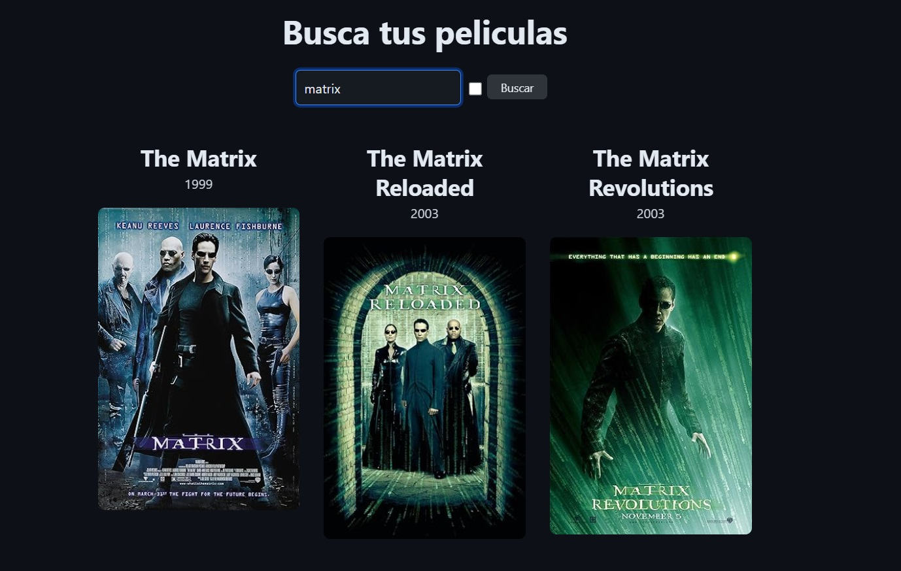

# Buscador de Peliculas

## Introducción
Web app hecha en React.js para una prueba técnica. Consiste en buscar peliculas consumiendo una Api y renderizar en pantalla.

## Tecnologías Usadas

- React.js
- Classless CSS

## Requerimiento

✅ Necesita mostrar un input para buscar la película y un botón para buscar.

✅ Lista las películas y muestra el título, año y poster.

✅ Que el formulario funcione

✅ Haz que las películas se muestren en un grid responsive.

✅ Hacer el fetching de datos a la API

Primera iteración:

✅ Evitar que se haga la misma búsqueda dos veces seguidas.

✅ Haz que la búsqueda se haga automáticamente al escribir.

✅ Evita que se haga la búsqueda continuamente al escribir (debounce)

API a usar: - https://www.omdbapi.com/